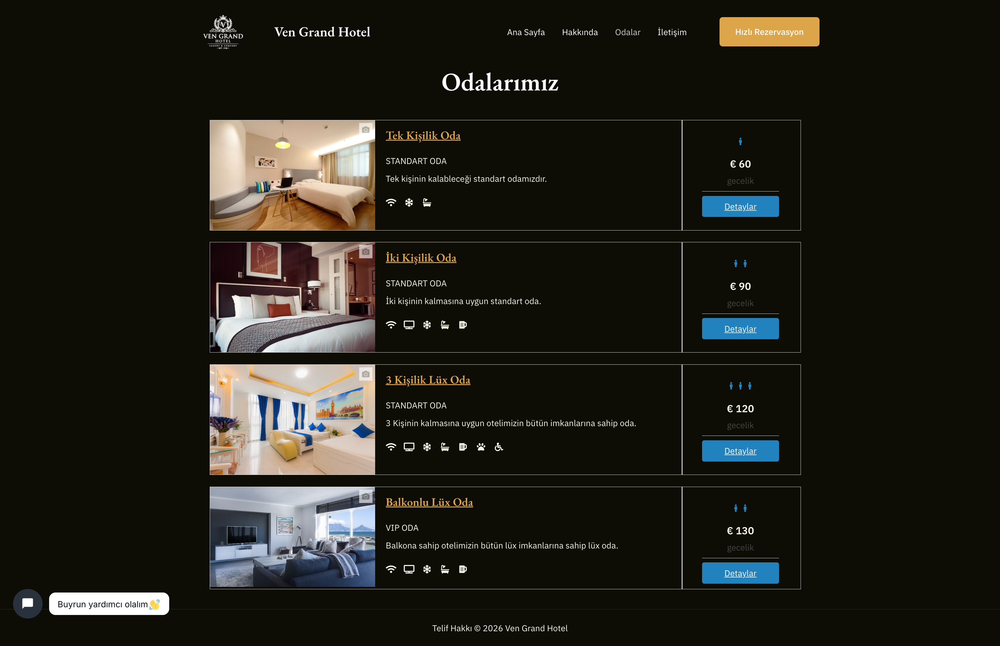
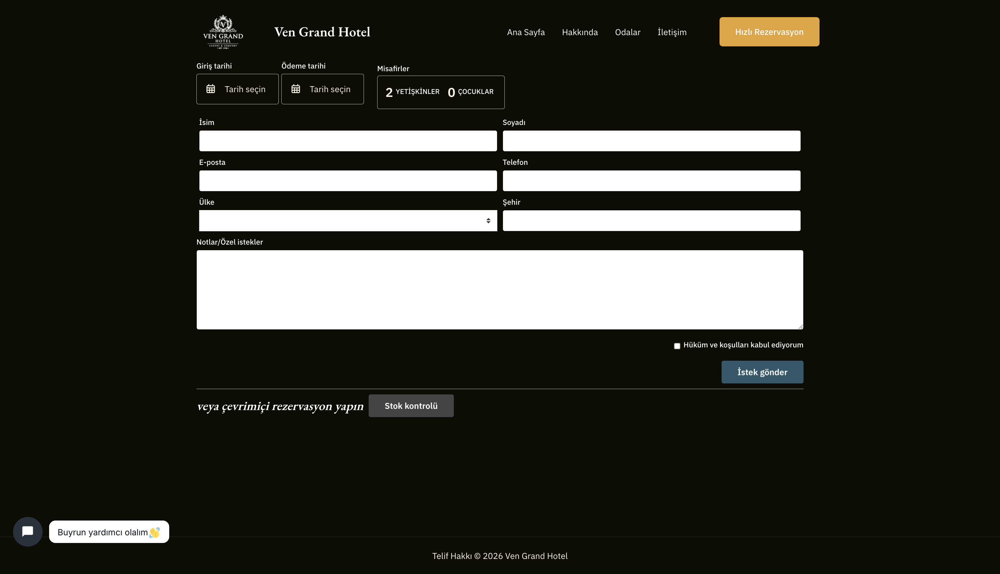
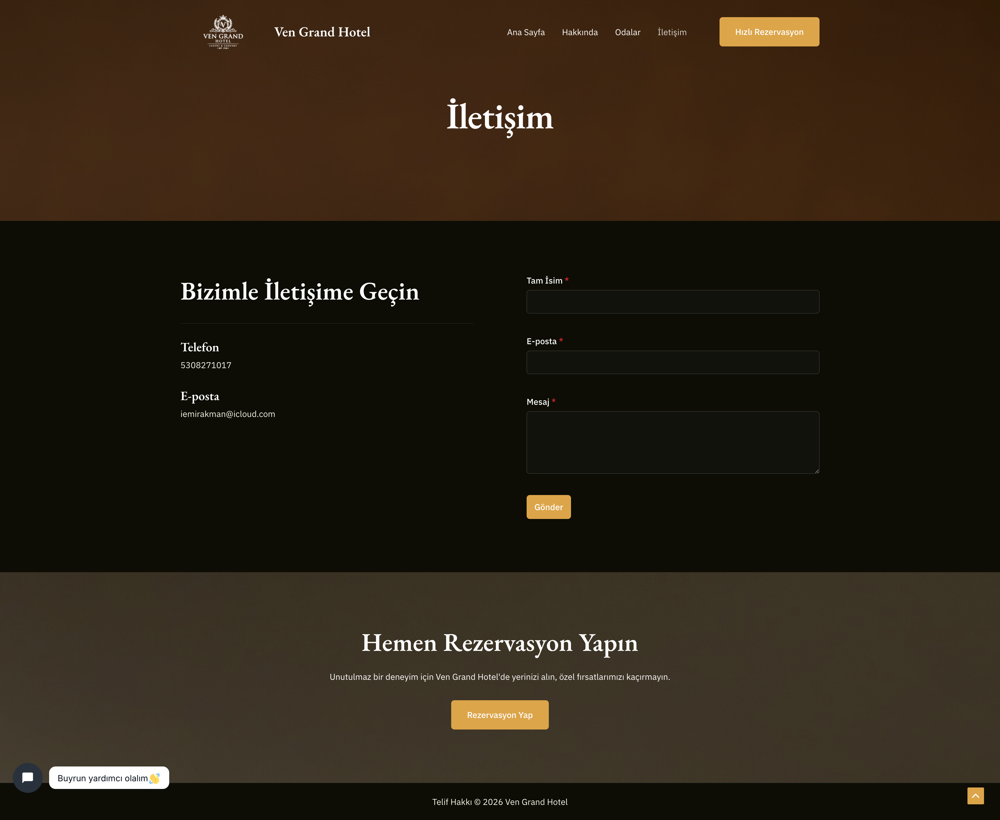

# 🏨 Ven Grand Hotel - Web Platform

Ven Grand Hotel is a comprehensive, end-to-end accommodation service platform built using WordPress. This project was developed as a final project for the Content Design course at Burdur Mehmet Akif Ersoy University to digitalize the online presence of a luxury hotel, integrate a fully functional booking engine, and manage customer interactions.

## 🚀 Features

* **Real-Time Booking Engine:** Integrated with VikBooking for room allocation, seasonal pricing, and real-time availability checks.
* **AI-Powered Customer Support:** Tidio AI chatbot integration for 24/7 instant visitor communication.
* **Responsive & Premium UI:** Built with Astra Theme and Elementor for a seamless, mobile-optimized experience across all devices.
* **Performance Optimized:** Configured with LiteSpeed Cache and WebP image optimization to ensure rapid page loading times on cloud hosting.
* **Custom Localization:** Translated complex booking backend systems into Turkish using Loco Translate for the local market.
* **Dynamic Forms:** Secure and modern customer inquiry forms managed via SureForms.

## 🛠️ Tech Stack & Infrastructure

* **CMS:** WordPress (v6.9.4)
* **Theme/Design:** Astra Theme, Elementor, Ultimate Addons
* **Core Plugins:** VikBooking (Reservation System), Tidio (AI Chat), Loco Translate (Localization), LiteSpeed Cache (Performance)
* **Database Management:** Advanced MySQL relations (e.g., `wp_vikbooking_rooms`, `wp_vikbooking_reservations`)
* **Hosting:** InfinityFree (Cloud setup with PHP/MySQL)

## 📸 Interface Screenshots

*(Note: Click on the images to view them in full resolution.)*

### Homepage (Ana Sayfa)
A dynamic landing page featuring high-resolution visuals and a quick-search booking widget.

### Our Rooms (Odalarımız)
Detailed listings of room types (Standard, Deluxe, Suite) with capacities and pricing.

### Reservation System (Rezervasyon)
Interactive booking module running on the VikBooking engine.

### About & Contact (Hakkımızda ve İletişim)
Corporate identity pages and dynamic contact forms with mapping.

## 💡 Problem Solving & Architecture

During the development phase, several architectural challenges were resolved:
1.  **Localization Barrier:** Overcame the lack of native Turkish support in the core booking engine by manually translating PO/MO files using Loco Translate.
2.  **Resource Constraints:** Solved server-side database connection issues on shared hosting by implementing aggressive HTML/CSS minification and WebP image compression.
3.  **Deployment:** Successfully migrated the complex local development environment (MAMP) to a live cloud server using All-in-One WP Migration, ensuring all permalinks and database relations remained intact.

## 👥 Developers

* **İbrahim Emir Akman** *

---
*This repository serves as a portfolio showcase. For a detailed breakdown of the UX design process, database logic, and future commercial scaling plans (VPS migration, Stripe/İyzico integration), please review the attached [Project Presentation PDF](./vengrandhotel_sunum.pdf).*
